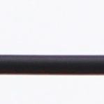
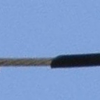

# Electrical Power Equipment Anomaly Detection (5-Fold OOF 소프트보팅)

Electrical Power Equipment 데이터셋을 기반으로 crop 이미지의 이상(결함) 여부를 판정하는 추론 파이프라인.
**ViT-B/16 + CLAdapter** 단일 아키텍처를 **Group 5-Fold 교차검증**으로 학습하고,
5개 fold 모델의 이상확률을 **균등 평균(소프트보팅)** 한 뒤, OOF에서 고정한 **임계값**을
적용해 정상/이상을 판정합니다.

---

## 빠른 시작 (한 줄)

| 상황 | 명령 |
|---|---|
| `run_all.sh` 파일만 받았을 때 (clone 포함) | `bash run_all.sh` |
| 이미 이 저장소를 clone했을 때 | `bash wire_inference.sh` |

→ 둘 다 **의존성 설치 · 체크포인트/검증셋 다운로드 · 추론(성능표 출력)** 까지 전부 자동.
자기 데이터로 돌리려면 `dataset/Anomaly`, `dataset/Normal` 에 이미지를 넣고 다시 실행하면 그걸 사용합니다.

---

## 1. 설치

```bash
conda create -n opgw python=3.10 -y
conda activate opgw
pip install -r requirements.txt
```

## 2. 체크포인트 다운로드

체크포인트는 용량 문제로 git에 포함되어 있지 않습니다.

체크포인트/검증셋은 용량·보안상 공개 저장소에 포함하지 않습니다.
**담당자로부터 받은 `run_all.sh` 로 실행하면 자동 다운로드**됩니다 (다운로드 링크는 `run_all.sh` 에만 포함).

```bash
bash run_all.sh   # 링크 내장 실행 파일 (담당자 배포) → clone·설치·다운로드·추론 자동
```

> 직접 받아야 하면 담당자에게 링크를 문의해 아래 경로에 배치하세요.

배치 경로:

```
checkpoints/
└── oof_loss2_k5/          # 가중치 모델
    ├── fold_0.pth ~ fold_4.pth
    └── operating_rule.json   # 고정 임계값 · 체크포인트 무결성 해시
```

## 3. 데이터셋 구성

```
dataset/
├── Anomaly/   # 이상 이미지   ← Anomaly/ + Normal/ 가 있으면 성능(P/R/F1/AUROC) 자동 계산
└── Normal/    # 정상 이미지
```

모델이 정상 동작하려면 **이미지가 결함 영역 기준으로 정밀하게 crop**되어야 합니다.
전체 사진을 그대로 입력하면 성능이 크게 저하됩니다.

| 정상 (Normal) | 이상 (Anomaly) |
|:---:|:---:|
|  |  |

---

## 4. 추론 (한 줄 실행)

```bash
bash wire_inference.sh
```

- `dataset/` (또는 `val_infer/`) 추론 → `predictions/` 저장
- `Anomaly/` + `Normal/` 하위폴더가 있으면 **Precision / Recall / F1 / AUROC 자동 계산**

### 옵션 (선택 — 전부 기본값 있음)

```bash
bash wire_inference.sh --input-dir /path/to/images --output-dir /path/to/out
```

| 옵션 | 설명 | 기본값 |
|---|---|---|
| `--input-dir` | 테스트 이미지 폴더 | `dataset/` 또는 `val_infer/` 자동 감지 |
| `--output-dir` | 결과 저장 폴더 | `predictions/` |
| `--threshold` | 판정 임계값 | `operating_rule.json` 자동 |
| `--device` | `cuda:0` / `cpu` | 자동 감지 |

## 5. 출력

| 파일 | 내용 |
|---|---|
| `predictions/predictions.csv` | 이미지별 fold별 점수 · 소프트보팅 점수 · 판정(Anomaly/Normal) |
| `predictions/summary.json` | 요약 + (GT 있으면) TP·FN·FP·TN · Precision/Recall/F1/AUROC |

GT(Anomaly/Normal 폴더)가 있으면 콘솔에 성능표가 함께 출력됩니다.

## 프로젝트 구조

```
.
├── run_wire.py            # 추론 본체 (5-Fold 소프트보팅 + 성능 자동계산)
├── wire_inference.sh      # zero-arg 진입점 (→ run_wire.py)
├── download_checkpoints.py
├── requirements.txt
├── inference/
│   ├── model_runtime.py   # 모델 로드 · 전처리
│   ├── infer_soft_voting.py
│   └── inference.py
├── src/                   # ViT-B + CLAdapter 모델 정의
├── oof/                   # OOF 폴드 구성 · 임계값 산정 (재현용)
└── checkpoints/
    └── oof_loss2_k5/      # 5-fold 체크포인트 + operating_rule.json
```

## 성능

성능은 테스트셋에서 `bash wire_inference.sh` 실행 시 자동 산출됩니다
(`Anomaly/` + `Normal/` 하위폴더 필요).

**검증셋(val_infer · 230장, 정상 115 · 이상 115) 결과:**

| TP | FN | FP | TN | Precision | Recall | F1 | AUROC |
|---|---|---|---|---|---|---|---|
| 102 | 13 | 15 | 100 | 87.18% | 88.70% | 87.93% | 95.79% |
